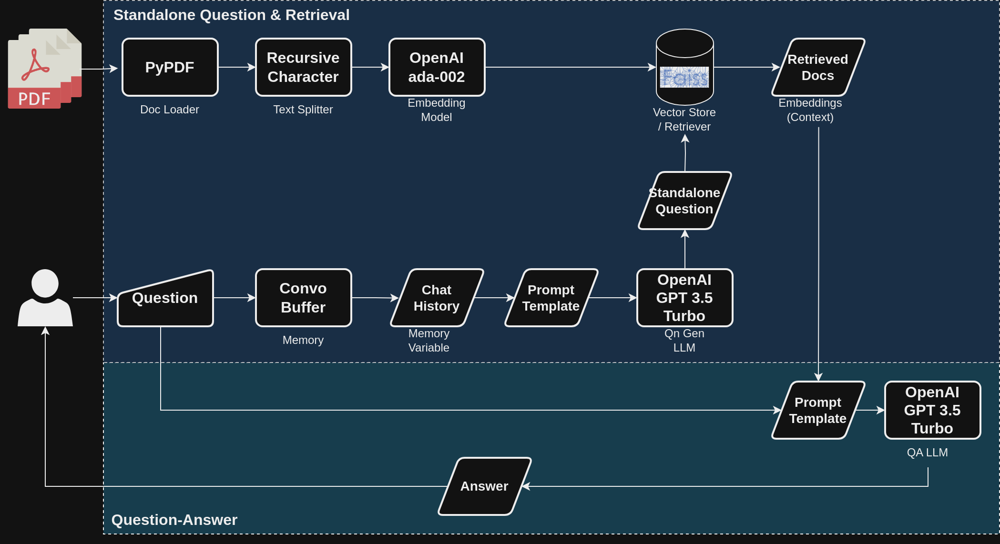

# Langchain: Financial Statement QA Chatbot
The goal of this project is to gain familiarity and proficiency with the main [Langchain](https://python.langchain.com/docs/get_started/introduction.html) components.  
Specifically, Langchain will be used as the framework to put together a chatbot that performs question-answer (QA) on uploaded financial statement pdfs.  
To be clear, this chatbot is actually able to perform QA for any type of pdf document.
  
# Repo Structure
```
.
├── assets
│   └── images
├── conf
│   └── base
├── data
├── docker
├── notebooks
└── src
    └── __pycache__
```
  
# Architecture
A `ConversationalRetrievalChain` is used. This chain comprises 2 steps:
1. Use input question + memory's `chat_history` to generate a "standalone" question that is used to retrieve the top 4 relevant documents from the vector store. Within the class method `from_llm` this chain corresponds to the parameter `question_generator`.
2. Use the retrieved documents as the context to the input question within the same prompt template, and feed the template into a QA chain to generate an answer. Within the class method `from_llm` this chain corresponds to the parameter `combine_docs_chain`.
  

  
For more information please refer to the official [docs](https://python.langchain.com/docs/modules/chains/popular/chat_vector_db) and source [code](https://github.com/hwchase17/langchain/blob/master/langchain/chains/conversational_retrieval/base.py).
# Prompt Engineering
Within `src/prompts.py` are the 2 prompt templates which are amended forms of the default prompts used for `ConversationalRetrievalChain`:
1. `COMBINE_QUESTION_PROMPT`: Used to generate the satndalone question and retrieve relevant document embeddings.
2. `QA_PROMPT`: Comprises the relevant document embeddings as context to the question and is used to generate the final answer.
  
Specifically, the `QA_PROMPT` was amended to reduce hallucinations using the following techniques:
* Zero-shot chain of thought (COT): Applied "Let's think step by step" to the prompt.
* Self-evaluation: Prompt contains instruction for LLM to admit it does not know something instead of making something up.
* Temperature: Set to a relatively low value of 0.2 by default to reduce randomness and "creativity" in answer generation.

For more information refer to this [article](https://newsletter.victordibia.com/p/practical-steps-to-reduce-hallucination).
  
# Limitations
* DocLoader: Langchain's API for PyPDF did not allow using Streamlit's UploadedFile directly.
* Memory: 
  * Could not use `ConversationSummaryMemory` as it does not save separate Human and AI messages.
  * `ConversationBufferWindowMemory` mixes up the order of messages within `chat_history`.
* Models: Ran into OOM issues when trying to use open-sourced embedding model (Instructor) and LLM (Falcon).

# Future Works
1. Figure out how to apply `ConversationBufferWindowMemory` outputs.
2. Try alternative `chain_type`. However, current `stuff` type should not be too memory intensive since the chain's context is fixed to 4 documents from the vector store retriever by default. Can try using chain param `verbose=True` to validate this.

# References
* Icons from Smashicons